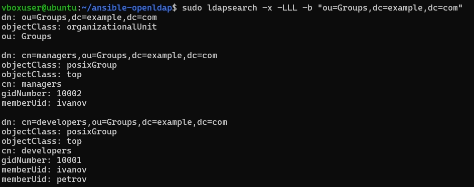
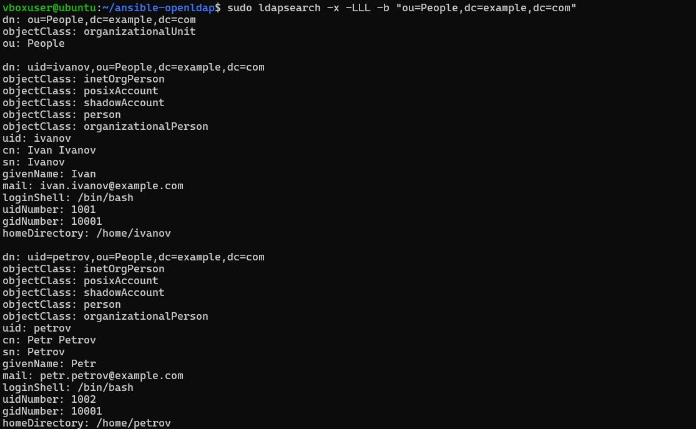

## Описание проекта
Проект автоматизирует установку и настройку OpenLDAP сервера на Ubuntu LTS с помощью Ansible.

## Выполненные задачи
-  Установка OpenLDAP сервера (slapd) и утилит
-  Настройка пароля администратора LDAP
-  Создание домена (example.com) и организации (Example Inc)
-  Создание базовой структуры каталога (ou=People, ou=Groups)
-  Добавление 2 пользователей: ivanov, petrov
-  Добавление 2 групп: developers, managers
-  Назначение пользователей в группы

## Требования для запуска
- Ubuntu LTS
- Ansible
- Права sudo
  
# Запуск установки
ansible-playbook -i inventory.ini playbook.yml

# Просмотр групп
sudo ldapsearch -x -LLL -b "ou=Groups,dc=example,dc=com"

# Просмотр пользователей
sudo ldapsearch -x -LLL -b "ou=People,dc=example,dc=com"

